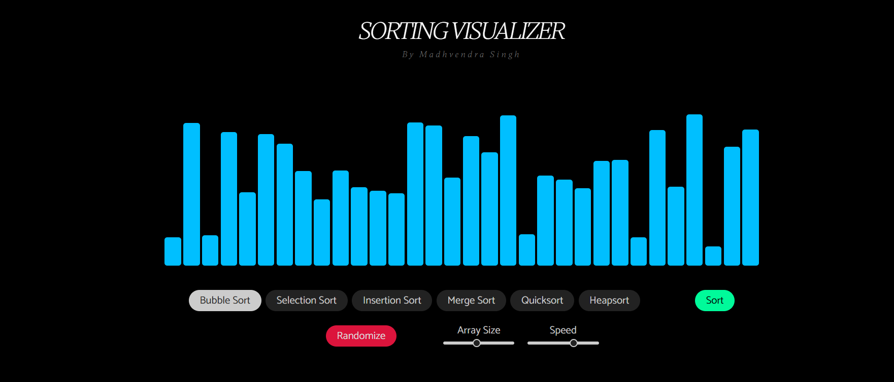

## 📊✨ Sorting Visualizer Web App

Welcome to **Sorting Visualizer**, a dynamic, interactive, and visually engaging web application that helps you understand how different sorting algorithms work under the hood!

> 🔥 Designed and developed by **Madhvendra Singh**

---

## 🚀 Live Demo

🔗 [Check out the live demo here!](https://sorting-visualizer-007.netlify.app)

---

## 📸 Screenshots



---

## 📖 About The Project

This web app visualizes multiple sorting algorithms in real-time, showing step-by-step transformations of an array using colored bars. Customize the speed and size of the array, select an algorithm, and visually experience how each one sorts your data.

---

## 🛠️ Features

* 🎨 Beautifully styled, clean and modern UI
* ⚙️ Adjustable array size and sorting speed
* 🔥 Multiple algorithms supported:

  * Bubble Sort
  * Selection Sort
  * Insertion Sort
  * Merge Sort
  * Quicksort
  * Heapsort
* ✨ Interactive buttons with dynamic array generation
* 📱 Fully responsive design
* ⚡ Smooth animations using asynchronous JavaScript

---

## 📂 Project Structure

```
sorting-visualizer/
├── index.html                # Main HTML structure
├── cssfile.css               # Styling and animations
├── script.js                 # Core functionality and event handlers
├── bubble-sort.js            # Bubble Sort logic
├── selection-sort.js         # Selection Sort logic
├── insertion-sort.js         # Insertion Sort logic
├── merge-sort.js             # Merge Sort logic
├── quicksort.js              # Quicksort logic
├── heapsort.js               # Heapsort logic
└── favicon.ico               # Custom favicon
```

---

## 🎨 Tech Stack

* **HTML5**
* **CSS3**
* **JavaScript (ES6)**
* **jQuery**
* **Bootstrap 4**
* **Google Fonts**

---

## ⚙️ How to Run Locally

1. **Clone the repository**

   ```bash
   git clone https://github.com/madhvendrasingh007/Sorting-Visualizer
   ```
2. **Navigate to the project directory**

   ```bash
   cd sorting-visualizer
   ```
3. **Open `index.html` in your browser**

---

## 💡 Future Enhancements

* Add **new sorting algorithms** (e.g., Radix Sort, Shell Sort)
* Implement **theme switcher** (Dark/Light mode)
* Include **performance metrics** (time/space complexity display)
* Make mobile animations smoother

---

## 📚 Credits

* Fonts: [Google Fonts](https://fonts.google.com/)
* UI Inspiration: \[Various online sorting visualizers and CSS animations]
* Special thanks to **Striver A2Z DSA Sheet** for motivation to deep dive into sorting algorithms.

---

## 🌟 Show Your Support!

If you like this project, consider giving it a ⭐️ on [GitHub](https://github.com/yourusername/sorting-visualizer)!

---

Would you like me to generate a badge section too (like GitHub repo size, contributors, license etc.)? ⚡
